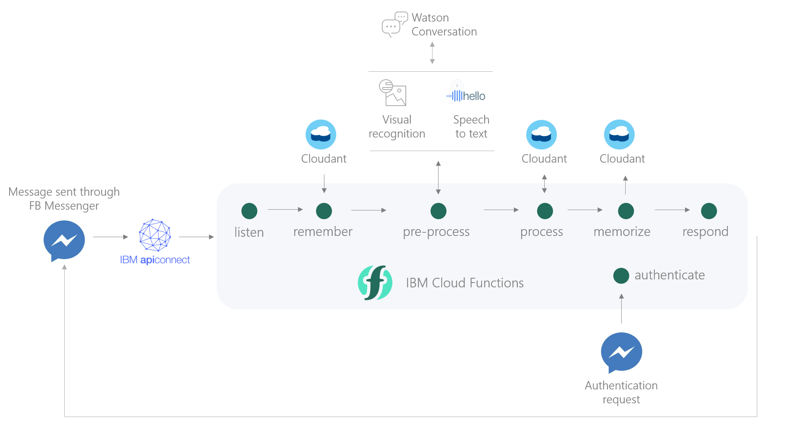

# Conversational AI for the Enterprise
### Using IBM Cloud Functions & Watson Conversation

#### Complete guide here: https://medium.com/@aamine/conversational-ai-for-the-enterprise-35acb9a1e591
#### Chat with Banking Buddy on Facebook Messenger here: https://www.messenger.com/t/thebankingbuddy

## Overview

## Actions

1. Listen — receive a request object from Facebook Messenger, and extract the sender’s userid, text, and attachments.

2. Remember — check records for any past conversations with the same user, and retrieve any previously stored context. If this is the first time the user has spoken to our bot, create a new record with their id and empty context.

3. Pre-process — handle possible input types; images, audio, and location pins. Classify images using visual recognition, transcribe audio using speech-to-text, extract coordinates from location pins, and finally, send the input to Watson Conversation and receive its response.

4. Process — resolve any pending actions as indicated by Watson Conversation, fetch data from Cloudant if needed, and append to output.

5. Memorize — update the user’s record with the new context.

6. Respond — format output and send it back to Facebook Messenger.

7. Webhook — to handle Facebook authenticatoin requests.

## Services Needed

1. Watson Conversation

2. IBM Cloudant NoSQL DB

3. Watson Visual Recognition

4. IBM API Connect

5. CloudConvert API, Google Cloud Speech & Google Cloud Storage
